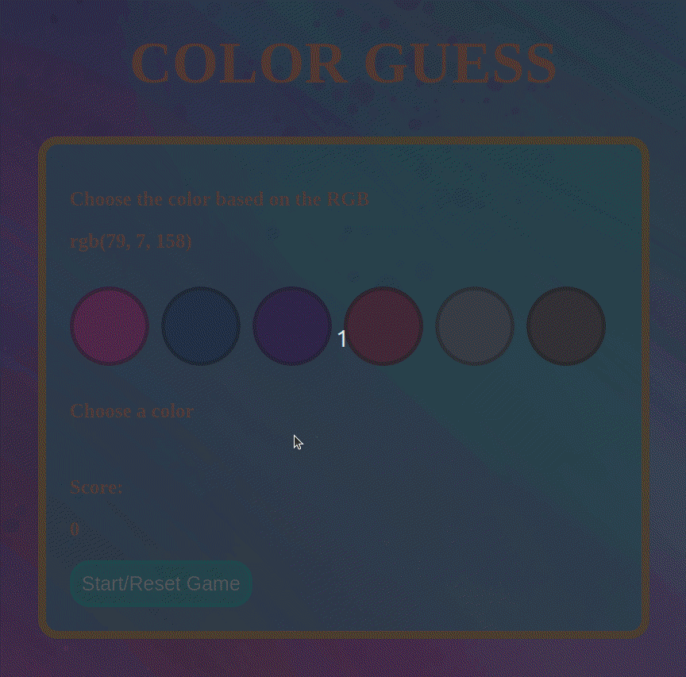

# Guess The Color Project!

## Description

Project developed during the Trybe software development course.
This project consists of an application of a color guessing game where your score is updated according to the correct answers.

## Tools

- HTML5;
- CSS3;
- Javascript ES6.

# Skills Developed

- DOM manipulation with javascript.
- Use of HTML and CSS.
